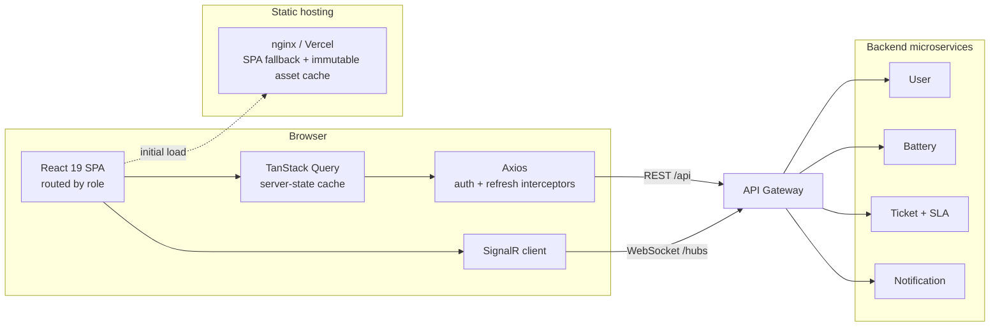
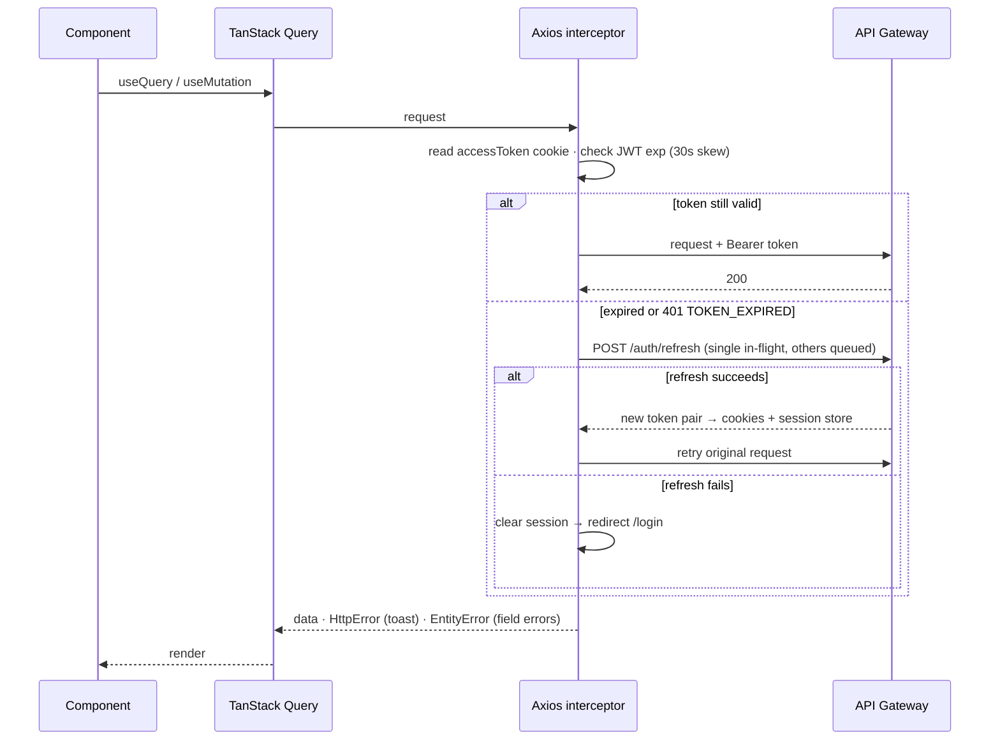

<div align="center">


# Solar Battery Management — Web Frontend

**Real-time monitoring, environmental alerting and SLA-driven maintenance ticketing for solar lithium-ion battery fleets.**

[](https://react.dev)
[](https://www.typescriptlang.org)
[](https://vite.dev)
[](https://tailwindcss.com)
[](https://tanstack.com/query)
[](https://vitest.dev)
[](https://pnpm.io)

</div>

---

The web portal of the **Solar Lithium-ion Battery Maintenance Management System** (capstone project GSU26SE55). It serves the three internal roles — **Admin**, **Manager** and **Staff** — over a .NET microservice backend, with live telemetry, incident streams and ITIL-style ticketing under priority-based SLAs (P1 4h · P2 24h · P3 72h).

The customer-facing app is a separate React Native client; this repository is the web portal only.

## Table of contents

- [What it does](#what-it-does)
- [Architecture](#architecture)
- [Requirements](#requirements)
- [Getting started](#getting-started)
- [Environment variables](#environment-variables)
- [Scripts](#scripts)
- [Project structure](#project-structure)
- [Key design decisions](#key-design-decisions)
- [Testing](#testing)
- [Build & deployment](#build--deployment)
- [Conventions](#conventions)
- [Contributing workflow](#contributing-workflow)
- [Troubleshooting](#troubleshooting)
- [Team](#team)

---

## What it does

| Capability                                              | Admin | Manager | Staff |
| ------------------------------------------------------- | :---: | :-----: | :---: |
| Overview dashboard & analytics                          |   ●   |    ●    |   ●   |
| Ticket queue, triage & assignment                       |   ●   |    ●    |   —   |
| Assigned tickets & SLA monitor                          |   ●   |    ●    |   ●   |
| Battery, environmental & device alert streams           |   ●   |    ●    |   —   |
| Battery types, sites & assets                           |   ●   |    ●    |   —   |
| IoT devices, calibration & firmware OTA                 |   ●   |    —    |   ●   |
| Knowledge base & public blog                            |   ●   |    ●    |   ●   |
| Notification pipeline (groups, templates, history, SMS) |   ●   |    —    |   —   |
| SLA calendar (non-working periods)                      |   ●   |    ●    |   —   |
| Accounts, roles & permissions, audit logs               |   ●   |    —    |   —   |

Cross-cutting: real-time ticket chat and presence over SignalR, Google OAuth + 2FA with trusted devices, light/dark theming, and role-scoped navigation driven by JWT permission claims.

---

## Architecture



**Authenticated request lifecycle** — one refresh at a time, no matter how many calls fail at once:



---

## Requirements

- **Node.js 22+** — the production image builds on `node:22.14.0-alpine`
- **pnpm** — version pinned in `package.json` → `packageManager`; enable with `corepack enable`
- A running backend API gateway (default `http://localhost:4001`)

---

## Getting started

Create a `.env` in the repository root first — keys are listed under [Environment variables](#environment-variables) — then:

```bash
corepack enable
pnpm install
pnpm dev            # → http://localhost:5173
```

The dev server proxies `/api` and `/hubs` to `VITE_DEV_API_TARGET`, so the app and the API share an origin in development. That is required by the Google OAuth flow: the `g_oauth_state` cookie is `SameSite=Lax` and is only sent on a same-origin callback.

Any `*.ngrok-free.dev` host is already allow-listed in `vite.config.ts` for tunnelled testing.

---

## Environment variables

Validated by Zod at boot (`src/config/env.ts`) — a missing variable throws on startup instead of failing later at the first request.

| Variable                | Required | Description                                                                                                                                                                                                                                                                                                                 |
| ----------------------- | :------: | --------------------------------------------------------------------------------------------------------------------------------------------------------------------------------------------------------------------------------------------------------------------------------------------------------------------------- |
| `VITE_API_BASE_URL`     |    ✅    | API gateway origin. **An empty string is valid and is the dev default** — Axios then builds relative URLs (`/api/...`) that follow the page origin and Vite's proxy forwards them. Hardcoding `http://localhost:5173` breaks tunnelled access: Private Network Access blocks an HTTPS page from calling a loopback address. |
| `VITE_GOOGLE_CLIENT_ID` |    ✅    | Google OAuth client id for social sign-in.                                                                                                                                                                                                                                                                                  |
| `VITE_WS_URL`           |    —     | SignalR hub origin. Falls back to `VITE_API_BASE_URL`; set it only when the hub lives on a different origin than the API.                                                                                                                                                                                                   |
| `VITE_DEV_API_TARGET`   |    —     | Dev-server proxy target (default `http://localhost:4001`). Build-time only, never read by the app.                                                                                                                                                                                                                          |

`.env` is never committed.

---

## Scripts

| Command              | Description                                                              |
| -------------------- | ------------------------------------------------------------------------ |
| `pnpm dev`           | Vite dev server with HMR and the `/api` + `/hubs` proxy                  |
| `pnpm build`         | `tsc -b`, then a production bundle into `dist/`                          |
| `pnpm preview`       | Serve the built `dist/` — the way to reproduce production-only behaviour |
| `pnpm lint`          | ESLint across the repo                                                   |
| `pnpm test`          | Vitest, single run                                                       |
| `pnpm test:watch`    | Vitest in watch mode                                                     |
| `pnpm test:coverage` | Vitest with V8 coverage                                                  |

> [!IMPORTANT]
> Type-check with **`tsc -b`**, never `tsc --noEmit`. This is a multi-project TypeScript setup (`tsconfig.json` → `tsconfig.app.json` + `tsconfig.node.json`); `--noEmit` on the root config checks **zero** files and passes silently.

---

## Project structure

```
src/
├── main.tsx · App.tsx            # root render, QueryClient, providers
├── config/env.ts                 # Zod-validated environment
├── router/                       # createBrowserRouter, ProtectedRoute, RoleRoute, layouts
├── components/ui/                # shadcn-generated primitives (not hand-edited)
├── lib/utils.ts                  # shadcn `cn()`
├── features/                     # one folder per role — mutually isolated
│   ├── auth/ · admin/ · manager/ · staff/ · landing/
│   └── {feature}/
│       ├── pages/                # {Name}Page.tsx
│       ├── components/{domain}/
│       ├── hooks/{domain}/       # TanStack Query hooks
│       ├── services/{domain}/    # API calls
│       ├── schemas/{domain}/     # Zod
│       ├── types/{domain}/
│       └── enums/
└── shared/                       # the only home for cross-feature code
    ├── components/{ui,layout,domain}/
    ├── hooks/ · services/ · schemas/ · enums/ · types/
    ├── lib/                      # axios, authz, errors, signalr, sse, sla, deviceId
    ├── stores/sessionStore.ts    # Zustand auth session
    └── utils/                    # queryKeys.ts, endpoints.ts, constants/
```

Inside every layer, files are grouped by **domain** (`account`, `ticket`, `battery`, `alerts`, `ambient`, `iot`, `kb`, `notification`, `dashboard`, `file`, `site`, `chat`); genuinely generic files stay at the layer root.

Feature isolation is enforced by ESLint (`no-restricted-imports`) for every pair of features — `features/admin` cannot import from `features/manager`. Shared code moves to `src/shared/`.

<details>
<summary><b>Route tree</b></summary>

```
/                        → redirect by role, or /login when unauthenticated
/login · /login/2fa · /register · /forgot-password · /invite/accept   → AuthLayout
/auth/google/callback    → OAuth callback
/admin/*                 → ProtectedRoute → RoleRoute(['ADMIN'])   → AppLayout
/manager/*               → ProtectedRoute → RoleRoute(['MANAGER']) → AppLayout
/staff/*                 → ProtectedRoute → RoleRoute(['STAFF'])   → AppLayout
/unauthorized            → 403 page
```

Route components are lazy-loaded (`router/lazyPage.tsx`) and the bundle is chunked by library group in `vite.config.ts`, so heavy dependencies (Recharts/d3, TipTap/ProseMirror, SignalR, icon sets) never reach the login shell.

</details>

---

## Key design decisions

**Session** — tokens live in cookies via `js-cookie`, never `localStorage`. Expiry is detected from the JWT `exp` with a 30s clock-skew allowance, so a refresh happens _before_ a request goes out stale. Concurrent 401s share a single in-flight refresh through a pending queue; a failed refresh clears the session and redirects to `/login`.

**Server state** — every API call goes through `services/` and is consumed via a TanStack Query hook; no `axios` inside a component. Defaults: `staleTime` 2 min, `gcTime` 10 min, `retry` 1, `refetchOnWindowFocus` false — overridden per query for live data (tickets 30 s; SLA countdown `staleTime: 0` + `refetchInterval: 30 s`).

**Error handling** — `shared/lib/errors.ts` splits `HttpError` (toast) from `EntityError` (per-field backend validation). Forms call `mutateAsync` inside `try/catch` with `handleErrorApi({ error, setError })`; non-form actions use the mutation's `onError`.

**Authorization** — the backend ships `perm[]` inside the JWT, so the frontend keeps no permission matrix: `checkPermission(user, P.TICKET_ASSIGN)` gates a control, `checkRole(user, 'ADMIN')` gates a route or a menu.

**Rendering** — React Compiler runs through Babel at build time; components are written without manual `useMemo`/`useCallback` noise.

---

## Testing

```bash
pnpm test                 # whole suite
pnpm test path/to/file    # one file
pnpm test:coverage
```

Vitest in jsdom with Testing Library; setup in `src/test/setup.ts`. The test config deliberately omits the React Compiler Babel preset — it is a build-time optimisation that does not change observable behaviour, and it doubles transform time.

---

## Build & deployment

```bash
pnpm build      # → dist/
pnpm preview    # serve dist/ locally
```

**Docker — primary target.** A multi-stage build installs with `--frozen-lockfile` from `pnpm-lock.yaml`, compiles the bundle with `.env` mounted as a BuildKit secret, and serves `dist/` from `nginx:stable-alpine` with an SPA fallback (`try_files $uri /index.html`). The `FRONTEND_BUILD_ID` build arg exists because BuildKit excludes secret contents from its cache key — changing only the env file would otherwise reuse a stale bundle layer. `Jenkinsfile` drives the pipeline.

**Vercel — preview target.** `vercel.json` supplies the SPA rewrite plus cache headers: immutable one-year caching for content-hashed `/assets/*`, `no-cache` for `index.html`.

> [!WARNING]
> The lockfile of record is **`pnpm-lock.yaml`**. A `package-lock.json` also exists in the tree and has drifted to different dependency versions — do not build from it.

---

## Conventions

| Kind      | Pattern                   | Example                   |
| --------- | ------------------------- | ------------------------- |
| Page      | `{Name}Page.tsx`          | `SlaCalendarPage.tsx`     |
| Component | `{Name}.tsx` (PascalCase) | `SlaCountdown.tsx`        |
| Hook      | `use{Name}.ts`            | `useSlaCalendar.ts`       |
| Service   | `{name}.service.ts`       | `sla-calendar.service.ts` |
| Schema    | `{name}.schema.ts`        | `sla-calendar.schema.ts`  |
| Types     | `{name}.types.ts`         | `ticket.types.ts`         |

Non-negotiables:

- No API calls inside components — `services/` → TanStack Query hook.
- `useState` is for UI state only (dialog open, active tab); Zustand holds the auth session and is never a server-state cache.
- One Axios instance: `shared/lib/axios.ts`.
- No TypeScript `enum` — use an `as const` object plus a type alias (`shared/enums/`).
- All API paths live in `shared/utils/endpoints.ts`; features reach them only through `services/`.
- Add a dependency only when the current stack genuinely cannot cover the case.

---

## Contributing workflow

One issue → one branch → one PR.

```bash
git switch -c feat/GH-123-short-slug
# implement, then:
pnpm build && pnpm lint && pnpm test
git commit -m "feat(#123): short description"
```

- Branches: `feat/GH-<n>-slug`, `fix/GH-<n>-slug`, `chore/…`, `docs/…`, `refactor/…`, `test/…`
- Commits: `type(#<issue>): description`
- PR body must contain `Closes #<issue>`
- Never push to `main` or `dev` directly; every PR needs ≥ 1 approving review and authors do not merge their own
- Gate before opening a PR: `tsc -b` clean · `eslint --max-warnings=0` clean · `pnpm build` succeeds · tests pass
- Never commit `.env` or `.claude/CLAUDE.local.md`

---

## Troubleshooting

<details>
<summary><b><code>tsc --noEmit</code> passes but the build fails</b></summary>

Expected: the root config type-checks zero files. Always use `tsc -b` (this is what `pnpm build` runs).

</details>

<details>
<summary><b>Vitest: <code>Failed to start forks worker</code> / <code>Timeout waiting for worker to respond</code></b></summary>

Seen on very recent Node builds. Run with the threads pool: `pnpm test --pool=threads`.

</details>

<details>
<summary><b>Google sign-in fails locally</b></summary>

The callback must be same-origin. Run `pnpm dev` with an empty `VITE_API_BASE_URL` so requests go through the Vite proxy, instead of pointing the app straight at the gateway origin.

</details>

<details>
<summary><b>Behaviour differs between <code>pnpm dev</code> and production</b></summary>

Reproduce with `pnpm build && pnpm preview` — that serves the exact bundle the Docker image ships, including minification, chunk splitting and React Compiler output, which the dev server and the test runner do not all apply identically.

</details>

---

## Team

Capstone project **GSU26SE55** — supervisor: Trương Long. Frontend maintainers:

| Name                      | Student ID | GitHub                                       |
| ------------------------- | ---------- | -------------------------------------------- |
| Trần Minh Trí (Team lead) | SE183109   | [@Shu1237](https://github.com/Shu1237)       |
| Nguyễn Nhật Minh          | SE170310   | [@CodeForFee](https://github.com/CodeForFee) |
